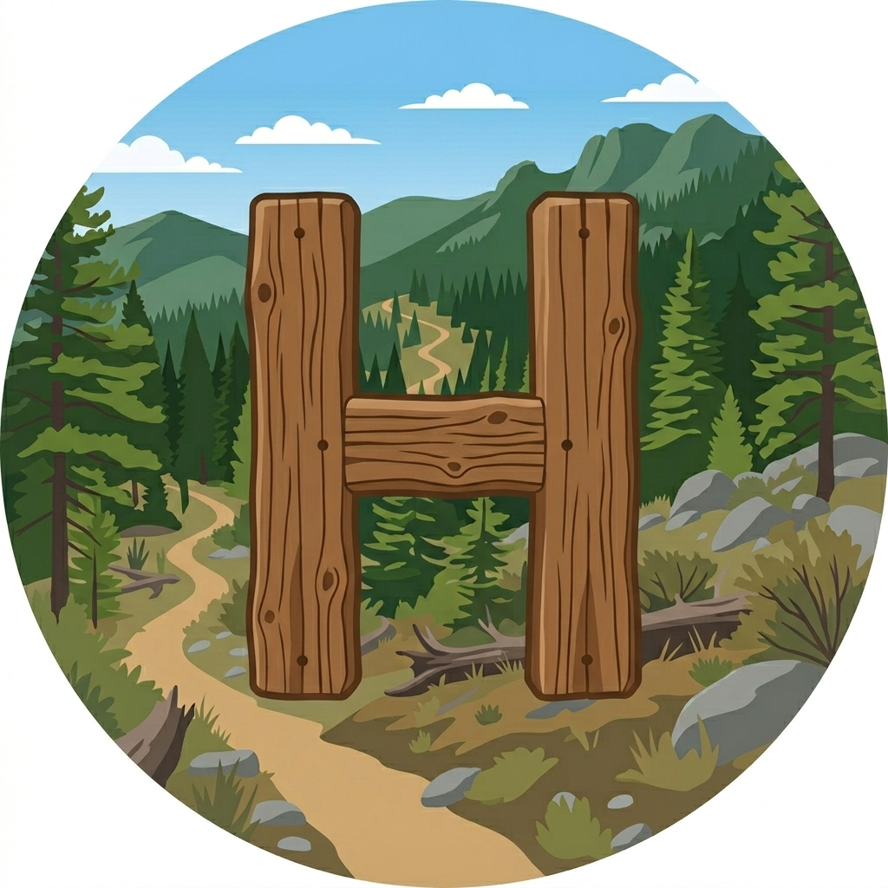
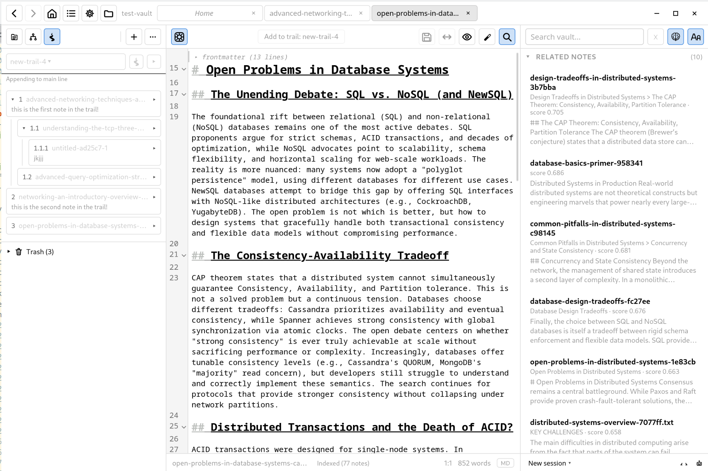

<p align="center">
  
</p>

# Hiker

A personal notes and knowledge system. Plain markdown on disk, semantic search, agent-accessible.

See `design.md` for the implementation design.


## What is Hiker?

Hiker is a modernized, multimodal take on Vannevar Bush's memex: a personal knowledge store you actually navigate, not just dump into. Every note lives as plain markdown on the filesystem, but the vault is wrapped in a hybrid lexical and semantic index, related-notes discovery, ordered "trails" through content, pinned "landmarks" in embedding space, and a graph "map" view.

Multimodal means non-markdown sources (PDFs, images, audio, web captures) are ingested via sidecar notes that sit alongside the originals without modifying them. Everything addressable, everything searchable, everything routable through the same primitives whether you are at the keyboard or an agent is reaching in over MCP.

The same vault is navigable by a human in the desktop UI and by agents over MCP, with identical search, related-notes, and trail semantics on both sides.

<p align="center">
  
</p>


## Core ideals

1. **Plain markdown on disk is the source of truth.** Every note is a file you can open, read, and edit with any tool. The system never traps content behind a database or proprietary format. Editing is plain text and sync is file-level — there is no CRDT or hidden binary edit log between you and your files; concurrent changes reconcile by 3-way text merge, and same-region conflicts surface for you to resolve rather than silently interleaving.

2. **The index is disposable; content is precious.** Anything regenerable from notes (embeddings, vector store, full-text index, extraction caches) is throwaway and can be rebuilt at any time. Backup, sync, and version-control rules apply to content only. If a feature requires the index to be authoritative, the design is wrong.

3. **Search and relatedness are the core feature, not organization.** Semantic + lexical search and AI-found connections are what make a pile of notes useful. Manual structure is optional on top.

4. **Start unstructured, layer structure later.** A note dropped into the inbox is a first-class citizen. Folders, tags, trees, and trails are things you grow into when they earn their keep, never required upfront.

5. **AI proposes, the user disposes.** Auto-generated organization (topic trees, suggested tags, folder placement) always shows up as a draft you approve, modify, or reject. The curated state is authoritative; re-running AI proposes diffs against it, never overwrites.

6. **Originals are sacred.** Non-markdown files (PDFs, images, audio) and external files (a `design.md` inside a project repo) are indexed without being moved or modified. Hiker's metadata lives in its own notes alongside, never injected into files Hiker doesn't own.

7. **Every searchable thing is a note.** Markdown notes, sidecar notes for non-md sources, pointer notes for external files, manifest notes for versioned references, all route through the same primitives. There is no parallel data model for "attachments" or "references"; everything addresses notes by ID and gets uniform handling in search, links, trails, and MCP.

8. **One substrate, two readers.** The same vault is navigable by you (UI) and by agents (MCP). Search, related-notes, and trails are exposed identically to both.

9. **Versioning where it has semantic meaning.** External reference docs (datasheets, scraped documentation) get explicit, named, diffable versions. Personal notes don't, they're continuous edits, backed up at the OS level.

10. **Composable knowledge spaces.** Multiple vaults (personal, work, school) coexist, can be searched together or scoped, and stay independent for sync and lifecycle.

11. **Spatial navigation as a first-class idea.** Trails (ordered walks), landmarks (pinned anchors), and the map (graph view) treat the vault as a place you move through, not just a bag of documents.

12. **Open source, built in Rust, on a small native stack.** egui desktop app + a Rust core. Apache-2.0 licensed.


## Features

Status legend: **[implemented]** working today, **[in progress]** partially built, **[planned]** specced and not started, **[deferred]** intentionally pushed past v1. Per-feature granularity lives in `docs/status.md`.

### Editor and vault

- **[implemented]** Native Rust editor widget (`editor/`, embedded via `editor-egui`) with tree-sitter syntax highlighting, multi-cursor, undo tree, and markdown live preview (cursor-line reveal, fade markers, heading styles, fenced code reveal)
- **[implemented]** Inline rendered widgets in live preview: LaTeX math (`$…$` / `$$…$$`), Mermaid diagrams (~25 types), WaveDrom waveforms, and natively-painted tables — drawn in place by Hiker's own pure-Rust engines (no browser, no JavaScript, no network), with cursor-reveal editing, a floating edit-preview popup, and a persisted on-disk diagram cache
- **[implemented]** Three-column layout: file tree, editor, discovery panel; collapsible and resizable sides
- **[partial]** Vault view: a read-only sidebar lens that regroups the tree by authorship, source, or capture/trail nesting and surfaces sidecar notes
- **[implemented]** Sidebar mode switcher (Files / Clusters / Trails) with persistent per-vault default
- **[implemented]** File tree with drag-and-drop move, inline rename, context menu, sort options, refresh-on-watcher
- **[implemented]** Soft-delete trash with restore, permanent delete, empty-trash, and orphan recovery
- **[implemented]** Pre-write drift check and conflict modal for external edits
- **[implemented]** Vault home screen with stats, recently-modified, and recently-accessed widgets
- **[implemented]** Per-buffer view options: live preview, word wrap, whitespace, line numbers, chunk boundaries, render `.txt` as markdown
- **[implemented]** Plain `.txt` ingest with structure-aware paragraph and sentence packing
- **[implemented]** Note mutation actions menu (LLM-driven in-buffer transforms; v1 entry: "Reformat as markdown")
- **[implemented]** Note properties tab (identity, file state, index state, chunks, access tracking, changes); trail/cluster membership and live-refresh deferred
- **[implemented]** Autosave: per-buffer crash-recovery sidecars and tab-state snapshots; silent restoration on vault reopen, no close-prompt modal
- **[implemented]** Status-bar version dropdown spanning the unified activity feed (current buffer + snapshots + pending agent proposals) with live refresh
- **[implemented]** Status-bar goto-line popup
- **[planned]** Help-panel keybind enumeration, in-place frontmatter editing inside the properties tab

### Index, search, and discovery

- **[implemented]** SQLite + sqlite-vec store, heading-bounded markdown chunker, fastembed (bge-small) embeddings
- **[implemented]** Filesystem watcher driven incremental indexing, with rename preservation and overflow rescan
- **[implemented]** Related-notes panel driven by per-chunk KNN
- **[implemented]** Vault-wide hybrid search (FTS5 lexical + semantic vectors, RRF fusion) in the discovery panel
- **[implemented]** Type-ahead search with debounce, epoch cancellation, click-to-chunk navigation, full keyboard nav
- **[implemented]** Lexical and semantic option menus (case sensitivity, prefix match, min-similarity, recency bias) persisted per vault
- **[planned]** CLI surface (the `hiker` binary is a stub today; reindex, query, and trash verbs specced but not yet implemented)
- **[planned]** Pluggable embedder backends (OpenAI, Ollama, Cohere, Mistral, HuggingFace) via the `llm` crate
- **[planned]** Folder, tag, lifecycle, and authorship scoping; multi-vault search; saved-collection results
- **[planned]** Tantivy lexical engine swap for ranking quality

### Organization and AI assist

- **[implemented]** Local agent loop with multi-provider LLM core (`core::agent::run_turn`, tool dispatch, cancellation, cap/timeout handling) and chat panel
- **[implemented]** Optional ACP client for external agents (Claude Code, Goose) — hiker MCP server auto-attached to the spawned session
- **[implemented]** Per-feature prompt files (two-tier loader: user `~/.config/hiker/prompts/` + vault `.hiker/prompts/`, vault wins); in-app settings-tab editor planned
- **[implemented]** Unified LLM/agent task queue: priorities, leases, event-streamed progress, direct worker plus external-MCP-client worker support
- **[implemented]** Changes log: append-only record of every note mutation (user + agent authored), per-path history, rollback primitives for agent edits and snapshot restore
- **[implemented]** Staging & review: pending agent proposals (`write_note`, `edit_note`, frontmatter, tags) route through `.hiker/staging/` when review-mode is on, surfaced in the unified activity feed and the version dropdown with author/source filtering
- **[implemented]** Patch review: per-hunk accept/reject for agent `edit_note` proposals, conflicted-state detection, anchor-drift safeguards, batch grouping
- **[partial]** LLM audit log (JSONL at `.hiker/agent-log/`, daily rotation, shared by core agent + MCP + ACP surfaces) done; cost-transparency status indicator planned
- **[implemented]** Topic trees: recursive RAPTOR-shaped clustering (Leiden + HDBSCAN) with LLM-generated cluster names, saved as editable markdown outlines in the vault, plus a beam-search placement classifier that triages new notes on save
- **[implemented]** Cluster editor: sidebar and full-pane tree editing (move / merge / split / recluster), per-cluster policies (tag / move / freeze), and a force-directed graph visualization encoding policy and member count
- **[in progress]** Deterministic (extractive) cluster naming as an LLM-free fallback, and GMM partitioning
- **[partial]** Inbox rules: basename/body regex matching to auto-move and auto-tag notes on creation (TOML config; no settings UI yet)
- **[planned]** One-shot suggestion proposals (move and tag modes) with markdown audit log and rejection history

### Spatial navigation

- **[implemented]** Trails: ordered, memex-style walks through notes — create, append waypoints, reorder, remove with cascade, side-trail hierarchies, capture-to-active, append-cursor insertion, watcher-driven auto-update on note move
- **[planned]** Landmarks: pinned anchors with nearest-landmark tagging in embedding space
- **[planned]** Map: graph visualization of the vault

### Canvas, boards, and linking

- **[implemented]** Canvas: an infinite pan/zoom whiteboard with file, text, link, and group nodes, bezier connectors, multi-select drag/resize, insert-from-vault, and viewport-culled rendering (`hiker-canvas/`)
- **[implemented]** Kanban boards: a board is a regular markdown note (`hiker.kind: board`) holding user-named columns of note-card and freeform-text cards; drag between columns, board index page, and full MCP control
- **[implemented]** Wikilinks: `[[Name]]` / `[[folder/Name]]` references with autocomplete, hover preview, click-to-resolve, ambiguity policies, rename-rewrite, and backlinks
- **[implemented]** Offline ZIM archive viewer (Wikipedia and friends) via the native-Rust `zxr` reader: article navigation plus Xapian BM25 full-text search, federated into vault search — no C/C++ dependencies

### Multi-device sync

Replaces the former Yrs-CRDT-over-libp2p model (now fully removed) with a file-level substrate that keeps plain markdown as the unit of sync.

- **[implemented]** 3-way text merge with content-hash merge-base recovery: disjoint edits merge automatically, same-region conflicts are detected and persisted across restarts
- **[implemented]** libp2p transport: mDNS peer discovery, Noise-encrypted file blobs, device enrollment, and a fork/rename/delete conflict surface
- **[partial]** Git transport (integrated and manual modes): commit-on-save, `Hiker-Author` authorship trailers, and observed-rename tracking
- **[in progress]** In-app sync UI: transport selector, in-editor conflict resolver, and push/pull status

### Multimodal ingest

- **[implemented]** `.txt` ingest via dedicated chunker
- **[planned]** PDF sidecars via docling/marker
- **[planned]** Image sidecars via tesseract OCR
- **[planned]** Audio sidecars via whisper.cpp
- **[planned]** Web capture and EPUB sources

### Agent surface (MCP)

- **[implemented]** MCP server (`rmcp` over streamable HTTP) brought up per-vault, with discovery file and per-tool toggles
- **[implemented]** Read tools: `search_notes`, `get_note`, `related_notes`, plus UI-context tools `get_active_note`, `get_open_notes`, `get_selection`
- **[implemented]** Write tools: `write_note`, `set_frontmatter`, `apply_tag`, `remove_tag`; `edit_note` (span-anchored patches, per-edit staging proposals)
- **[implemented]** Board tools: `boards_list`, `board_get`, `board_create`, `board_add_card`, `board_add_text_card`, `board_move_card`, `board_set_card_text`, `board_remove_card`, and column ops (`board_add_column`, `board_rename_column`, `board_reorder_column`, `board_delete_column`)
- **[implemented]** Audit log and per-tool review-mode routing through staging
- **[planned]** Staging introspection (`list_pending_proposals`, `get_pending_proposal` with per-edit anchor-status liveness) and `amend_pending_proposal`
- **[planned]** Trails, landmarks, collections, and bulk write tools (`move_note`, `delete_note`) — each lands with its backing feature

### Diff viewer

- **[implemented]** Unified diff renderer with line + intraline character-level highlights
- **[implemented]** Snapshot preview diff, dirty-buffer-vs-disk diff, and pending-proposal-vs-disk diff via toolbar toggle
- **[planned]** Three-way merge diff for drift-conflict and whole-file proposal resolution

### Platform

- **[implemented]** All-Rust egui desktop shell. Workspace layout:
  - `app/` — the eframe binary (`hiker`) wiring panels, vault state, and the MCP runtime
  - `egui-workbench/` — reusable IDE-style layout crate (activity bar, dockable sides, tabbed editor groups, bottom panel, status bar) built on `egui_tiles`; the desktop shell is built on top of it
  - `editor/` — in-house editor widget (`editor-core`, `editor-view`, `editor-egui`, `editor-md`, `editor-ts`, `editor-diff`): a class-leading editing engine in Rust with tree-sitter highlighting, multi-cursor, undo tree, decorations, and markdown live preview
  - `hiker-render/` — egui-agnostic renderer umbrella: `hiker-math` (LaTeX), `hiker-mermaid` (diagrams), `hiker-wavedrom` (waveforms), `hiker-htmlview` (HTML/CSS), and `hiker-graph` (graph layout), each emitting SVG/paint data
  - `hiker-canvas/` — canvas/whiteboard model + view; `hiker-sync/` + `hiker-git/` — pluggable file-level sync transports; `zxr/` — native-Rust Xapian/ZIM reader
  - `hiker-llm/`, `hiker-theme/`, `hiker-features/`, `hiker-lite/` — LLM provider abstractions, theming, capability flags, and a lightweight build
  - `core/`, `mcp-server/`, `cli/` — vault, index, agent, and MCP runtime crates (rusqlite, fastembed, notify each isolated to one module)
- **[implemented]** Per-vault settings (TOML, user + vault layered, strict load, write-back preserving comments)
- **[implemented]** Tracing-based observability with daily-rotating file logs; chunk-boundary editor gutter
- **[implemented]** Multi-vault open with default-vault auto-open
- **[deferred]** Tracing spans per pipeline stage, in-app log viewer, frontend log bridge
- **[deferred]** `.hiker/ignore` config file
- **[planned]** QA harness: golden-set evaluation, thumbs feedback, synthetic-corpus benchmark

# Related Research
```
RAPTOR https://arxiv.org/html/2401.18059v1
Possible improvement on clustering https://en.wikipedia.org/wiki/Leiden_algorithm
```
