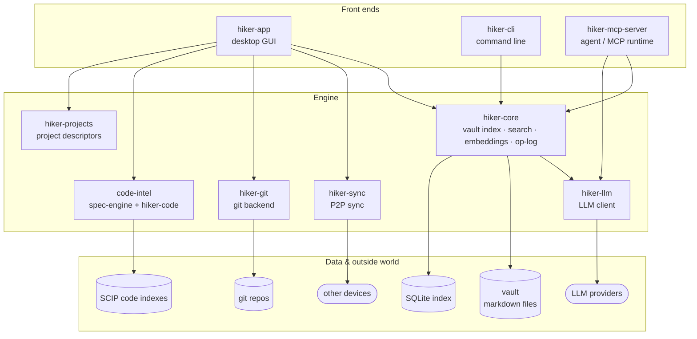
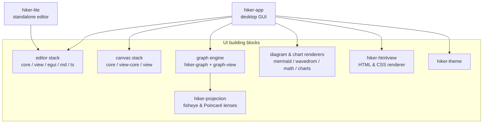

# Architecture

A bird's-eye view of how Hiker is put together. This page is for the curious
user and the new contributor — it names the moving parts and shows how they
stack, without specifying any of them. (The precise feature specs live in
[`../docs/`](../docs/index.md).)

Like every page in this manual, the diagrams below are ordinary Mermaid blocks:
open this note in Hiker and they render with Hiker's own diagram engine — the
same one drawn in the diagram.

## The big picture

Hiker is a Rust workspace built in layers. At the bottom sit the things your
data actually lives in (plain files, SQLite, git). One engine crate —
`hiker-core` — owns the vault: indexing, search, embeddings, and the op-log.
Everything you see on screen is an egui app layered on top of that engine,
assembled from a set of deliberately UI-free building blocks (the editor,
canvas, graph, and rendering crates).

The first diagram follows your *data*: how the front ends reach the engine,
and how the engine reaches the outside world.

The second diagram follows the *pixels*: the library crates the desktop app is
assembled from. Each is a pure, egui-free engine with a thin egui shell on
top, which is how `hiker-lite` can reuse the editor stack with no vault behind
it.

## Reading the layers

**Front ends.** `hiker-app` is the desktop app — every tab you open (notes,
canvas, graph, boards, charts, the code graph) is a panel inside it.
`hiker-cli` drives the same engine from the terminal, `hiker-lite` is the
editor stack packaged as a lightweight standalone editor with no vault behind
it, and `hiker-mcp-server` exposes Hiker to agents over MCP.

**UI building blocks.** Most of what's on screen is built from crates that
deliberately know nothing about egui (or about Hiker): the editor's rope and
state machine, the canvas document model, the graph layout engine, and the
projection math are all pure libraries, each with a thin egui shell on top.
That's also why the diagram, chart, and HTML renderers can be reused — the
Mermaid block above is rendered by `hiker-mermaid`, the same crate the app
uses for every diagram in this manual.

**Engine.** `hiker-core` is the single source of truth for the vault: it
watches your markdown files, maintains the SQLite index, computes embeddings
for semantic search and clustering, and records every change in the op-log
(which powers history, blame, and sync). Around it sit focused satellites:
`hiker-sync` replicates the op-log between your devices over libp2p,
`hiker-git` wraps libgit2 so git stays confined to one crate, `hiker-llm`
talks to whichever LLM provider you configure, and the `code-intel` crates
read SCIP indexes to link your notes and specs to real code.

**Data & outside world.** Your notes stay plain markdown files on disk — the
SQLite database is a rebuildable index, never the source of truth. Everything
else (git remotes, sync peers, LLM providers, SCIP indexes produced by your
code tooling) is reached through exactly one engine crate each, so the
boundaries in the diagram are real ones in the code.
