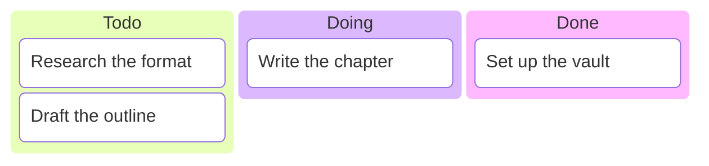

# Boards

A board is a kanban-style view over your vault: columns of cards, where each card
usually points at a note, and "moving" a card just changes which column it sits in.
Use a board to track work across stages (*Todo → Doing → Done*), to triage an inbox,
or to curate any set of notes into a deliberate left-to-right layout.

A board is **its own curated document**. The columns and the order of cards live in
the board, and the notes a card points at are never touched by being on a board —
moving a card never edits the note. The same note can sit on as many boards as you
like, in a different column on each.

> A board is an interactive surface you open in a tab — not an in-note block. The
> diagram below only illustrates the kanban idea; the real board has clickable,
> draggable cards.

The kanban idea:



## Creating a board

- **Sidebar `+` menu → Board** creates a board with the default columns *Todo /
  Doing / Done*, opens it in the board view, and lets you rename it inline.
- The **Boards** page (see below) also has a **New board** button.

New boards land in your boards folder (`boards/` by default, configurable). You can
move a board anywhere later by dragging it in the file tree — it carries its identity
in its frontmatter.

## The board view

A board opens as columns side by side. Columns render **left-to-right**, and cards
within a column render **top-to-bottom** — both exactly in the order the board
defines. Empty columns still show, so you always have a target to drop into.

Each card shows the referenced note's **title**. A resolved note reads in the accent
colour (it's openable); a card whose note has been deleted or moved away shows greyed
with a **"broken reference"** hint, and stays put so you can decide what to do with it.

**Click a card** to open its note in the editor pane. A small **×** on each card
removes it from the board (the note itself is untouched).

## Moving cards

**Drag a card** to another column to move it, or within a column to reorder it. (A
per-card **Move to ▸** menu does the same if you'd rather not drag.) A move is just an
edit to the board document — versioned, undoable, and syncable like any other edit.
The referenced note is never read or written.

## Adding cards

- **From the file tree:** right-click a note → **Add to board…**, then pick the board
  and column. (Dragging a note row onto a column does the same.) A note that's already
  on that board is disabled — but you can still add it to a *different* board.
- **Freeform cards:** each column has a **+ Add card** affordance that creates a card
  with its own text and no note behind it — handy for quick items, checklist entries,
  or placeholders. Click it to edit the text in place.

## Managing columns

From a column header's menu you can **add**, **rename**, **reorder** (move left /
right), and **delete** columns. Deleting a column that still holds cards asks first
(the cards' references leave the board; the notes are untouched). You can also set a
**WIP limit** on a column from its menu — the header then shows a count like
`Doing (3/3)` and flags when you go over (it's a soft warning, not a hard block).

You can equally hand-edit all of this in the markdown view (see below) — it's the
same document either way.

## Board or Markdown

A board carries a **View as: Board / Markdown** control. *Board* is the column view
above. *Markdown* is the plain editor over the same document, where you can hand-edit
the frontmatter (the columns and cards) and write freeform prose in the body — the
body is yours to annotate with what the board is for, and the board view never
overwrites it. It's one document rendered two ways, not two tabs.

## The Boards page

Because boards are per-document and have no single home, the **Boards** page (from the
toolbar actions menu) lists every board in the vault, each row showing its title,
column count, and card count — empty boards included. Click a row to open that board;
the page also has **New board** and a per-row **Delete**.

## Deleting a board

Deleting a board moves the board document to trash (it's recoverable), after a confirm
step. Only the board — its columns and card references — goes away; the notes it
pointed at are never touched. Delete from the Boards page's per-row action, or from the
file tree like any note.

## How a board is stored

A board is a normal markdown note whose frontmatter declares it a board. You rarely
need to look, but the shape is simple — ordered columns, each with an ordered list of
cards that reference notes by path:

```yaml
---
hiker:
  kind: board
  columns:
    - name: Todo
      cards:
        - { path: "research/raptor-paper.md" }
    - name: Doing
      cards:
        - { path: "work/migration.md" }
    - name: Done
      cards: []
---
# Q3 Roadmap

Freeform prose about what this board is for.
```

Because cards reference notes **by path**, when you move or rename a referenced note,
its card path updates automatically — the board keeps pointing at the right note.

## A live example

Open **[example-board.md](example-board.md)** to see a populated board: its cards point
at real pages of this manual, so it opens with notes in its columns rather than empty.

## Tips

- **The note doesn't know it's on a board.** Membership and column live in the board,
  not in the note's metadata — so the same note can be *Doing* on one board and *Today*
  on another.
- **Freeform cards for quick stuff.** Not everything deserves its own note. Use a
  column's **+ Add card** for a one-off item you just want to track.
- **Edit by hand when it's faster.** Switch to **Markdown** to bulk-edit columns or
  paste a list of cards; switch back to **Board** to see it render.
- **Broken card?** A greyed "broken reference" card means its note moved away or was
  deleted. Remove it with the **×**, or repoint it by editing the path in Markdown.
