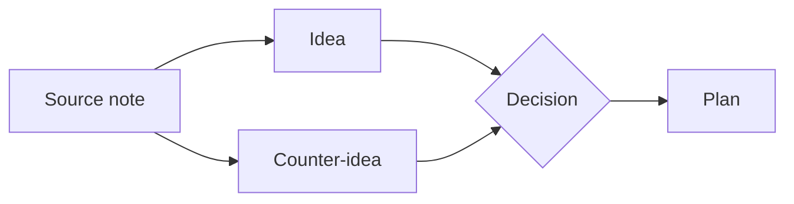

# Canvas

A canvas is an infinite spatial board: notes, text cards, links, and groups laid
out in 2D and connected by arrows. It's where you think with space — clustering
related notes, sketching a plan, building a mood board, or wiring an argument
together — instead of stacking everything in a single linear document.

A canvas is a real file in your vault (a `.canvas` file). It opens in its own tab,
saves and syncs like a note, and lives in the file tree with its own glyph. Each
card that points at a note holds a *pointer*, never a copy: the note stays exactly
where it is, and editing it on the canvas edits the one real note.

> A canvas is its own document — it is *not* an in-note block. The diagrams below
> only sketch what a canvas looks like; the real thing is an interactive surface
> you open in a tab.

A canvas in spirit:

## Opening and creating a canvas

- **Create one** from the sidebar `+` menu → *Canvas*. A fresh empty canvas opens
  in its tab with its name ready to rename.
- **Open one** by clicking a `.canvas` row in the file tree.

New canvases save on their first edit, the same as a note. Until then nothing is
written to disk.

## The two tools

The toolbar carries a **Select / Hand** toggle (or press **V** / **H**):

- **Select** (default) routes a left-drag by what's under the cursor — drag empty
  space to marquee-select, drag a card to move it, drag a handle to resize, drag a
  connector to draw an edge.
- **Hand** sends *every* left-drag to a pan, for when you just want to move around.

Independent of the tool, you can always pan by holding **Space** and dragging, or
by dragging with the **middle mouse button** — the cursor shows a grabbing hand
while you do.

## Moving around

- **Pan** — drag with the Hand tool, Space-drag, middle-mouse drag, or (depending
  on your scroll setting) a plain two-finger scroll.
- **Zoom** — scroll the mouse wheel, **Ctrl/Cmd-scroll**, or **pinch** on a
  trackpad. Zoom homes in on the cursor.
- **Fit to content** — the **View** menu (eye icon) frames the whole board at once.
  It's the fastest way to get un-lost.

### Scroll behaviour

Whether a plain scroll pans or zooms is up to you. The toolbar's **gear** menu (and
the global Settings window — they share one control) offers **Auto** / **Pan** /
**Zoom**. *Auto* is the default: a mouse wheel zooms, a trackpad pans. The gear menu
also holds the *two-finger swipe navigates Back / Forward* toggle, if a horizontal
trackpad swipe ever misfires.

View state — your pan, zoom, and each card's own scroll position — is remembered
across closing and reopening the tab, and across restarts.

## Adding things

The toolbar's create control is a `+` split-button:

- **Click the `+`** to mint a brand-new vault note and drop it on the canvas as a
  card, ready to edit. (**Cmd/Ctrl+N** while a canvas tab is focused does the same.)
- **Click the caret** for the rest:
  - **Add text** — an empty text card whose words live in the canvas itself.
  - **Insert from vault…** — an autocomplete picker over your notes and sources;
    pick one to drop a pointer card to it.
  - **Add link…** — a card for an external URL.
  - **Add group** — a labelled container (see *Groups* below).

Everything drops at the centre of the view and is selected, so you can reposition
it right away. You can also reach all of these by **right-clicking empty canvas**.

A third way to add an existing note: **right-click a note in the file tree →
Add to canvas**, and pick the target canvas.

## Working with cards

### Move, resize, select

- **Click** selects a card; **Shift-click** adds to the selection; **drag empty
  canvas** (Select tool) marquee-selects a region. **Esc** or an empty click clears.
- **Drag** a selection to move it. A multi-selection moves together.
- **Resize** a single selected card with its eight handles. Handles grow slightly
  under the cursor so you can see what you're about to grab.

### Edit a card in place

Cards are read-only until you ask to edit. **Enter edit mode** by **double-clicking**
a card, by **clicking an already-selected** card again, or by pressing **Enter** /
**F2** with a single card selected. A bright accent outline marks the active editor.

- A **note card** edits the *real note* behind it. Type here and the change shows up
  in any open tab of that note, and vice versa — there's only ever one copy. Press
  **Ctrl/Cmd+S** while editing a note card to save that note.
- A **text card** edits its own text, which is stored in the canvas file. Saving the
  canvas (**Ctrl/Cmd+S**) commits it.

Even when you're not editing, a note card shows the note's *live* contents,
including unsaved changes from another tab — so it never looks stale.

### Scroll and zoom inside a card

A card is a little window onto its content, decoupled from the board's zoom, so text
stays readable however far out you are. Scroll the wheel over a card to scroll its
*content*; scroll over empty canvas to zoom the *camera*. Bump a single card's text
size with **Ctrl/Cmd+wheel** or its right-click **Zoom in / out / Reset zoom**.

### Open a card's note in a new tab

**Right-click a card → Open in new tab** opens the referenced note (or, for a link
card, double-click to open the URL in your browser). Double-clicking a note card
that's too small to edit opens it in a tab too.

## Drawing edges

Hover or select a card and four small **connector handles** appear just outside its
edges. Click one and a rubber band follows your cursor; click a second card to
connect them. You can also press-and-drag a handle to connect in one motion. Drag an
existing edge's endpoint to re-anchor it elsewhere, and **double-click an edge** to
give it a label. Edges (even curved ones) are clickable, so you can select and
delete them.

## Groups

A **group** is a labelled frame that visually contains the cards inside it. Add one
from the create menu — then either click for a default-sized frame, or drag to
rubber-band exactly the rectangle you want. Grab a group by its **header strip** (the
band along its top) to move it together with everything inside; resizing a group
reframes just the container.

## Tidy it up

**Auto-arrange** (in the right-click empty-canvas menu) lays the board out
hierarchically — the same layered engine the graph view uses — and keeps the result
roughly centred where you were looking. Groups become clusters: each group frame
resizes to wrap its members after the arrange.

## Deleting

Select something and press **Delete** / **Backspace**, or use the right-click
**Delete** verb. Deleting a card also removes any edges attached to it. (While you're
editing a card's text, Backspace deletes *text* — the canvas keys only act when no
editor has focus.)

## Undo

**Ctrl/Cmd+Z** / **Ctrl/Cmd+Shift+Z** undo and redo your spatial edits before you
save. Once you save, the canvas joins the document's version history like any note.

## Projection modes (focus + context)

A big canvas can be hard to take in at once. The **View** menu carries a
**Projection** selector — **Off** (the normal flat view), **Fisheye**, and
**Poincaré** — that bends the board so the part you care about stays large while the
rest gracefully shrinks toward the edges instead of scrolling off.

- **Fisheye** is a gentle lens around a focus point (the centre, the cursor, or your
  selection — your pick). Cards near the focus stay full size; distant ones shrink.
- **Poincaré** is the full hyperbolic disk: a navigate-only mode where you read and
  move around rather than edit. **Drag** re-centres the disk (there's no edge to fall
  off), and **clicking a card glides it to the centre**. Edges curve as geodesic
  arcs, and far cards fade toward the rim and collapse to dots.

Each mode reveals its own sliders (strength, focus source, detail thresholds,
geodesic edges, fly-to). Sensible defaults ship, so flipping a mode on already looks
right. Projection is purely a view — it never changes your saved coordinates, the
`.canvas` file, or sync.

### The corner overview

The View menu's **Overview** section turns on a small circular minimap in a pane
corner that shows the whole canvas projected as a Poincaré disk. Cards currently
on screen are highlighted. **Click a node in the overview to fly the main view to
it**, drag inside it to re-centre, and **click the overview to swap it full-pane** —
the main view demotes into the corner, and clicking the corner swaps back.

## Level of detail

Zoom far out and the canvas stays smooth: cards too small to read collapse to a cheap
placeholder (a one-line title plus skeleton bars), and edges simplify — at a distance
they become straight, slightly thicker strokes, and once an endpoint is a bare dot the
**arrowheads disappear** so a dense constellation reads as structure rather than a
hairball.

## View as JSON

The **View** menu can flip a canvas between the spatial editor and a plain text editor
over the raw `.canvas` JSON (with syntax highlighting) — both over the one document.
It's an escape hatch for hand-editing; the file tree's right-click also offers *View
as JSON*.

## A live example

Open **[example.canvas](example.canvas)** to see a small populated canvas: a couple of
text cards, a card pointing at a real manual page, and an edge between them.

## Tips

- **Lost? Fit to content.** The View menu's *Fit to content* (or the right-click
  menu) frames everything instantly.
- **One note, one copy.** A note card is a pointer. Editing it on the canvas is
  editing the real note — there's no separate copy to drift.
- **Hand tool for pure panning.** If a drag keeps grabbing cards when you only want to
  move around, switch to the Hand tool (**H**) — or just hold **Space** and drag.
- **Try Poincaré on a big board.** For reading a sprawling canvas without getting
  lost, switch Projection to *Poincaré* and click around — the node you click glides
  to the centre with its whole neighbourhood in view.
