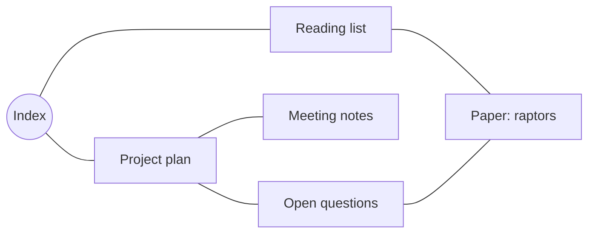

# Graph view

The graph view is a map of how your notes connect. Every note is a node; every
link between two notes is an edge. It's a fast way to see the *shape* of your
vault — which notes are hubs, which are orphans, and how a cluster of ideas hangs
together — and to jump around by exploring connections rather than searching.

> The graph is an interactive surface you open in a tab, not an in-note block. The
> diagram below only sketches the idea; the real graph is live, laid out for you,
> and pannable.

What a graph is, roughly:

## Opening the graph

Open the **Graph** tab to see your whole vault as one node-link map. The same
engine also powers the cluster graphs, so everything below applies wherever you
see a graph.

## Getting around

- **Pan** by dragging empty space.
- **Zoom** by scrolling.
- **Click a node** to follow it — it opens that note. Hover a node for a small
  preview card of its title and a snippet.
- **Rebuild** re-scans the vault, and **Reset view** re-frames everything if you've
  wandered off.

The header's **eye icon** opens the view-options menu — layout, sizes, colours,
projection, and the toggles below all live there.

## Layouts

The view-options menu lets you pick how nodes are arranged:

- **Force-directed** (the default) — nodes repel each other and links pull them
  together, settling into a natural map where tightly-linked notes bunch up. It
  runs live in the background, so the layout eases into place without freezing the
  UI.
- **Radial / Vertical / Horizontal tree** — deterministic tree layouts that spread
  the graph out from a root.
- **Layered** — a top-down (or left-right) ranked layout, good for things that flow
  in a direction. A **Direction** control picks Top-Down or Left-Right.

### Stable layouts across rebuilds

A plain force layout re-randomizes itself every time the graph changes. Hiker keeps
yours *stable*: when you rebuild or re-cluster, retained nodes are tethered to where
they were, so the picture **morphs** — the changed parts move while the rest holds
its shape — instead of scattering fresh. The **Anchor stiffness** slider tunes this:
`0` lets everything re-settle freely; higher values hold nodes tightly in place.

## Display controls

Also in the view-options menu:

- **Labels**, **Edges**, and **Show note preview** toggles.
- **Node**, **Edge**, and **Label** size sliders.
- **Colours** for nodes, edges, labels, and the background.

## Projection modes (focus + context)

A large graph is the hardest thing to read on a flat plane — pan one way and the rest
scrolls off. The **Projection** selector in the view menu fixes that with a
focus+context lens: **Off** (the normal flat view), **Fisheye**, and **Poincaré**.

- **Fisheye** magnifies a focus region and gracefully shrinks the periphery, so the
  neighbourhood you're looking at stays large while distant nodes stay visible at the
  edges. Choose what the lens follows — **Center**, **Cursor**, or **Selection**.
- **Poincaré** projects the whole graph into a hyperbolic disk. The centred node is
  big and its entire neighbourhood is on screen at once; everything else compresses
  toward the rim and fades out. This is the focus+context idea at full strength:
  there's no edge to scroll off, so you *navigate by re-centring*.
  - **Drag** to re-centre the disk on a new region.
  - **Click a node** to **fly it to the centre** with a smooth glide (the
    *Click to fly-to* toggle).
  - **Scroll** to zoom; the Poincaré zoom range is wide, so you can magnify a dense
    recentred region enough to read it.
  - **Edges curve** as geodesic arcs — a link to a far node visibly bows — and nodes
    fade toward the rim.

Each non-Off mode reveals its own controls (strength, focus source, size falloff,
detail thresholds, geodesic edges, fly-to). Good defaults ship, so just flipping a
mode on already looks right. Projection is a lens over the layout — it never changes
the underlying positions.

### Level of detail

As nodes shrink toward the rim (or just at far zoom) they step down a ladder: a full
node near the focus, a title-only dot mid-disk, and a bare edge-endpoint marker near
the rim. That's what keeps a big graph legible at the edges instead of cluttered.

### The corner overview

A small **Poincaré minimap** can sit in a pane corner showing the whole graph
projected around your current focus — an at-a-glance overview while the main pane
stays flat. **Click it to expand**: the disk fills the pane and the flat view demotes
into the corner, and clicking the corner swaps them back. You can render the minimap
as a circle or a square.

## Tips

- **Click to travel.** The graph is a navigator — click a node to open its note and
  keep exploring by connection instead of by search.
- **Find the hubs.** In the force layout, the densely-connected notes pull to the
  centre and the orphans drift to the edges. It's a quick read on your vault's
  structure.
- **Big vault? Go Poincaré.** Switch Projection to *Poincaré* and click around: the
  node you click glides to the centre with its whole neighbourhood in view, so you
  never lose your place.
- **Tune the morph.** If re-clustering jumps around too much, raise *Anchor
  stiffness* so nodes hold their positions; lower it for a livelier re-settle.
