# Widgets & diagrams

Hiker renders certain blocks of a note *in place*. You write plain text — a math
expression, or a fenced code block in a small diagram language — and when your
cursor isn't on it, Hiker replaces the source with the rendered picture. Move the
cursor back into the block (or select it) and the source returns for editing,
with a live preview floating alongside.

These blocks render in place, all by Hiker's own pure-Rust engines (no browser,
no JavaScript, no network):

| Widget | You write | Renders as |
|---|---|---|
| **Math** | `$…$` (inline) or `$$…$$` (display) | Typeset LaTeX |
| **Mermaid** | a ` ```mermaid ` fenced block | A diagram (flowcharts, sequence, pie, …) |
| **WaveDrom** | a ` ```wavedrom ` fenced block | A digital timing waveform or register layout |
| **Tables** | a `\| … \|` pipe table | A grid whose cells can hold markdown, math, diagrams, or images |

How the reveal works, for all of them:

- **Cursor away** → the source is hidden and the rendered widget is shown.
- **Cursor inside** (or a selection touching it) → the source reappears for
  editing, and a small non-intrusive preview of the result floats nearby so you
  can see your edits land.
- **Escape** dismisses the preview popup without leaving edit mode.

Everything below is a live example. Open this note in Hiker and each block renders.

---

## Math

Math uses LaTeX syntax. Wrap a formula in single dollar signs for **inline** math
that sits on the text baseline, like the mass–energy relation $E = mc^2$ written
mid-sentence, or the quadratic roots $x = \frac{-b \pm \sqrt{b^2 - 4ac}}{2a}$.

Wrap it in double dollar signs for a **display** equation on its own centered row:

$$\int_{-\infty}^{\infty} e^{-x^2}\, dx = \sqrt{\pi}$$

Display math handles the usual structures — fractions, roots, sub/superscripts,
big operators with limits, matrices, and Greek:

$$\sum_{n=1}^{\infty} \frac{1}{n^2} = \frac{\pi^2}{6}
\qquad
A = \begin{pmatrix} a & b \\ c & d \end{pmatrix}$$

> **Syntax reference.** Hiker's math engine follows the standard LaTeX math
> conventions. The KaTeX [supported-functions
> list](https://katex.org/docs/supported.html) is a good catalogue of the
> commands and symbols available.

---

## Mermaid

[Mermaid](https://mermaid.js.org/) is a text-based diagram language. You describe
the diagram in words and the layout is computed for you. Hiker ships its own
Mermaid renderer covering a wide range of diagram types — one live example of each
follows, grouped by what they're for.

Each type has a one-line intro and a link to its page in the
[Mermaid documentation](https://mermaid.js.org/intro/) for the full syntax.

### Flowcharts & processes

**Flowchart** — boxes and arrows for any process or decision tree.
([docs](https://mermaid.js.org/syntax/flowchart.html))

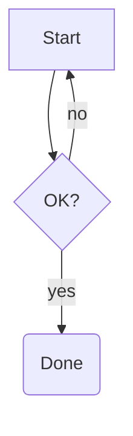

Flowcharts also support styling (`classDef`/`style`), nested `subgraph`s, and
clickable nodes (`click A "https://…"`):

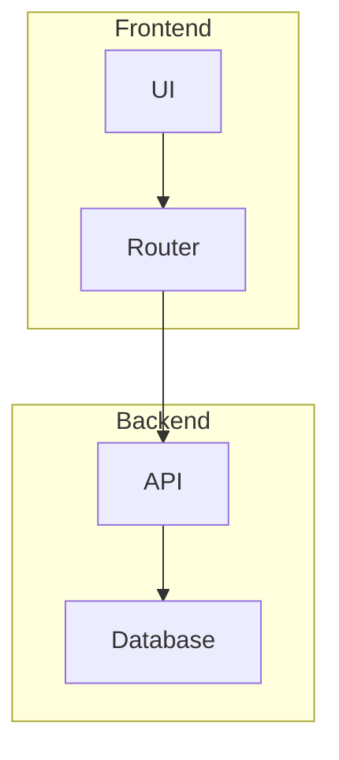

**Sequence diagram** — messages exchanged between participants over time, with
loops, alternatives, and notes.
([docs](https://mermaid.js.org/syntax/sequenceDiagram.html))

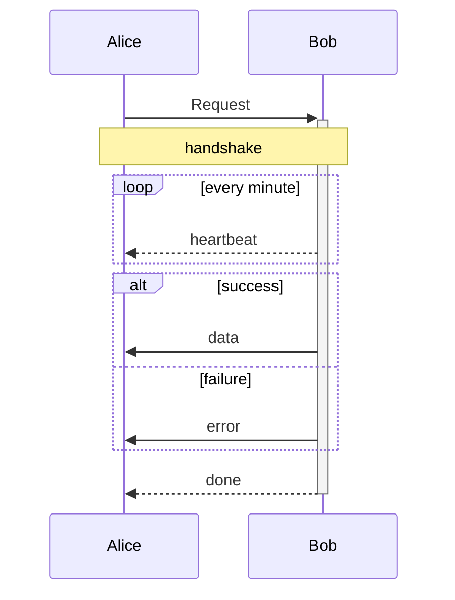

**State diagram** — states and the transitions between them.
([docs](https://mermaid.js.org/syntax/stateDiagram.html))

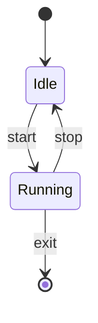

**Class diagram** — classes, fields, methods, and inheritance.
([docs](https://mermaid.js.org/syntax/classDiagram.html))

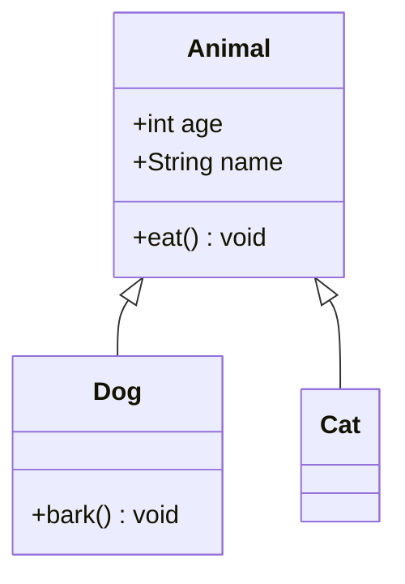

**Entity-relationship (ER)** — tables and the cardinality of their relationships.
([docs](https://mermaid.js.org/syntax/entityRelationshipDiagram.html))

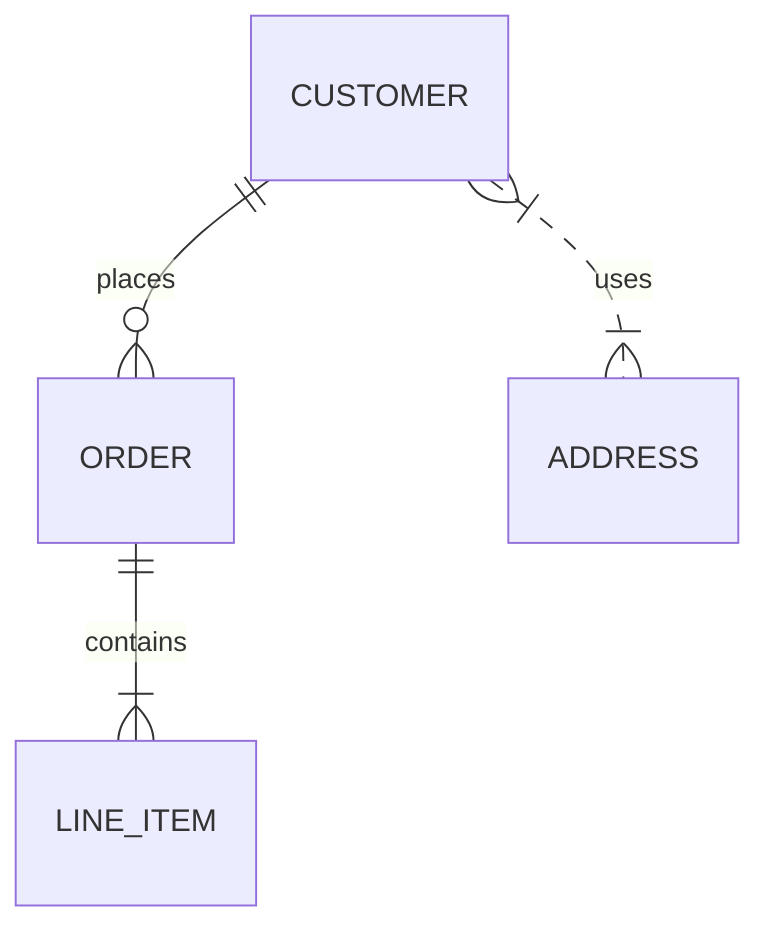

### Data & charts

**Pie chart** — proportions of a whole.
([docs](https://mermaid.js.org/syntax/pie.html))

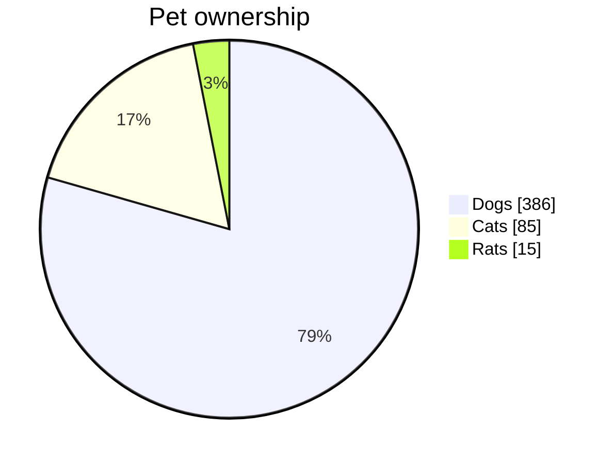

**XY chart** — bar and line series on shared axes.
([docs](https://mermaid.js.org/syntax/xyChart.html))

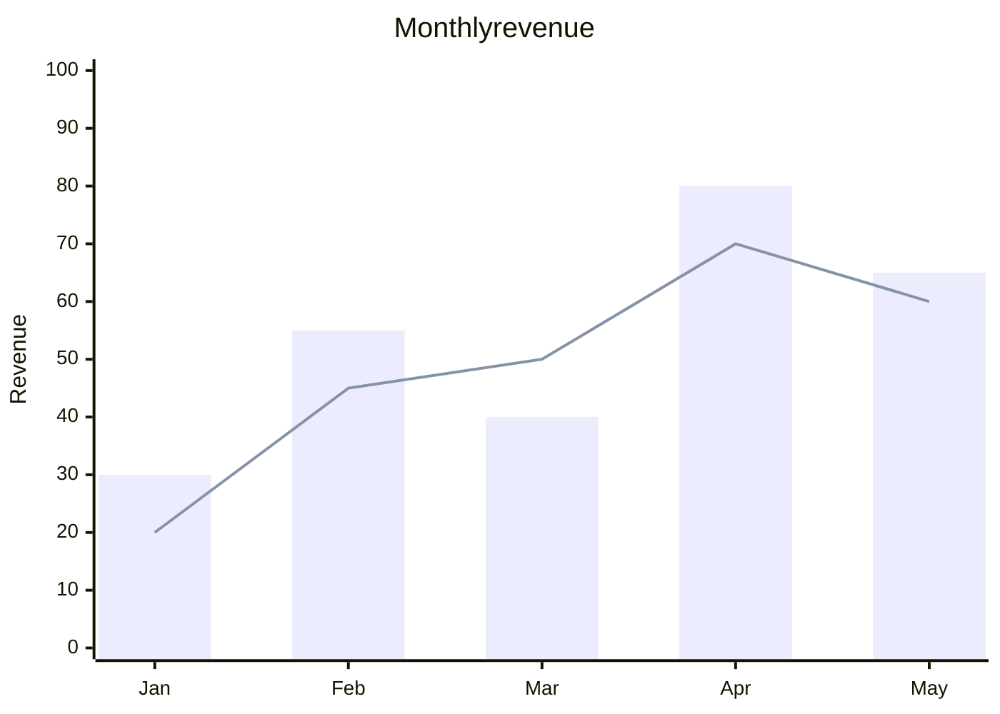

**Radar chart** — compare several entities across several axes.

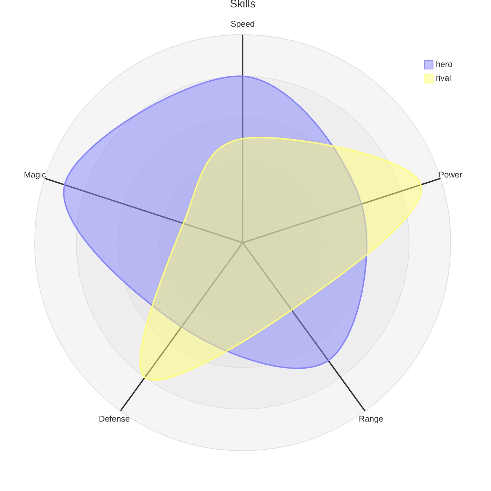

**Sankey diagram** — flow quantities between stages.
([docs](https://mermaid.js.org/syntax/sankey.html))

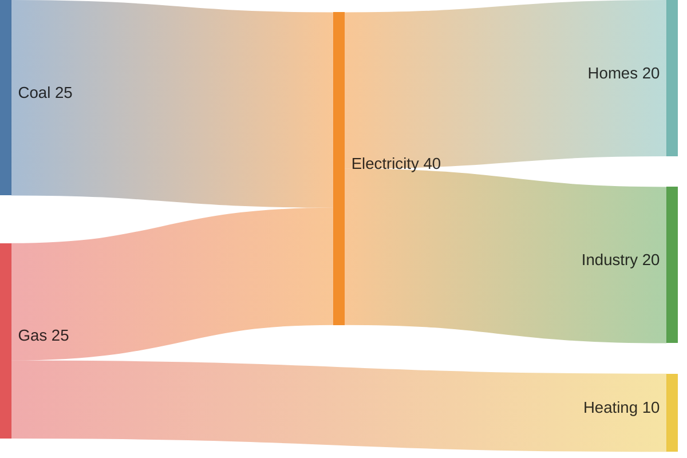

**Treemap** — nested rectangles sized by value.

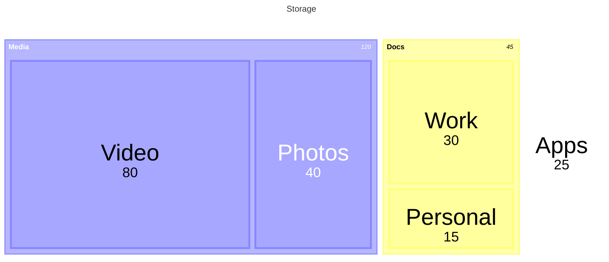

**Quadrant chart** — plot items across two axes into four quadrants.
([docs](https://mermaid.js.org/syntax/quadrantChart.html))

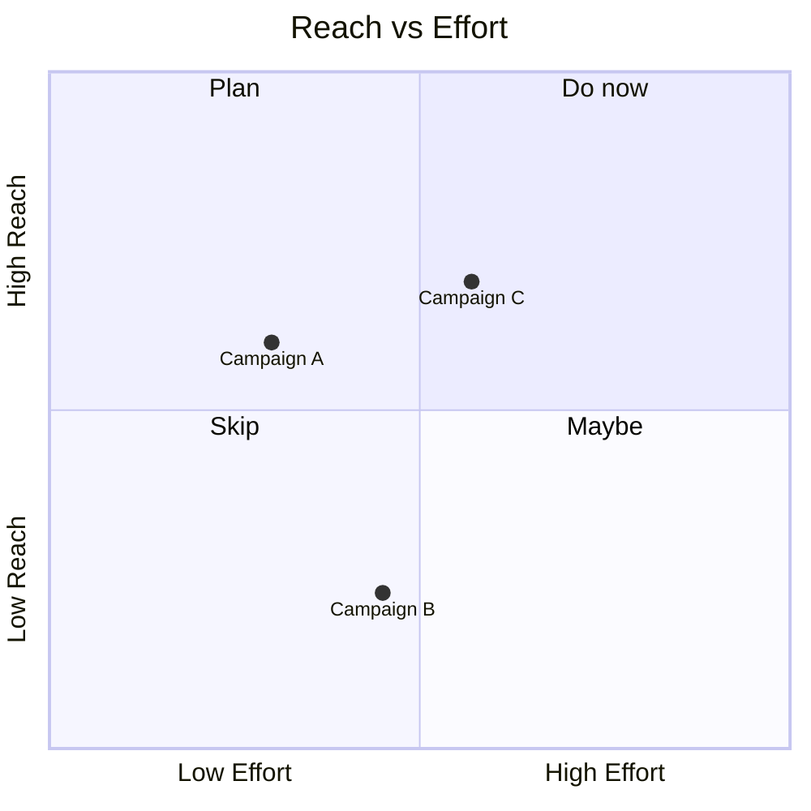

### Planning & project

**Gantt chart** — task schedule with sections, dependencies, and milestones.
([docs](https://mermaid.js.org/syntax/gantt.html))

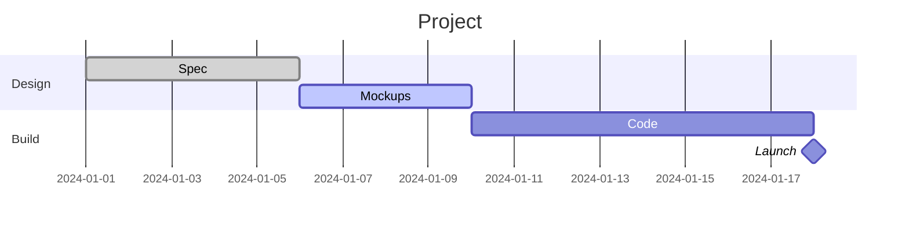

**Kanban board** — columns of cards.

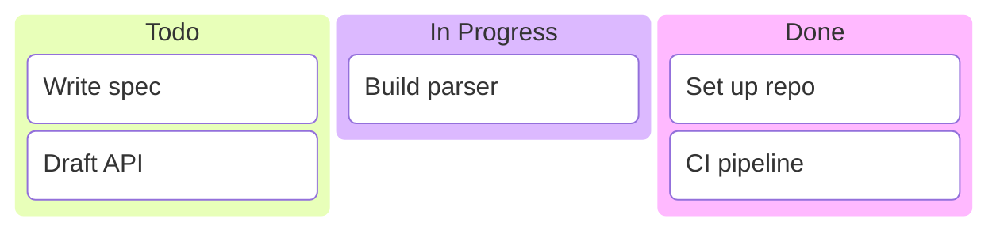

**Timeline** — events along time, grouped into sections.
([docs](https://mermaid.js.org/syntax/timeline.html))

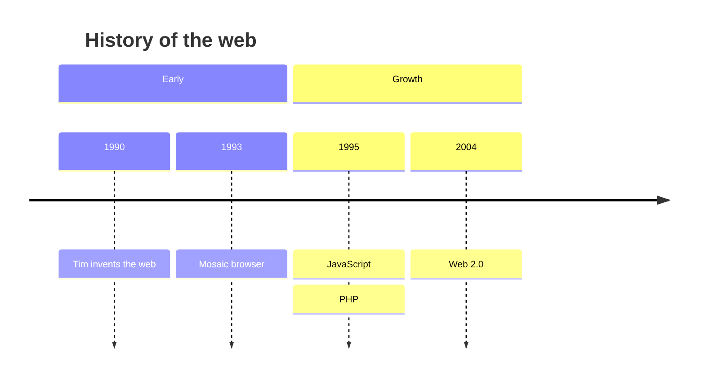

**User journey** — steps a user takes, scored by sentiment.
([docs](https://mermaid.js.org/syntax/userJourney.html))

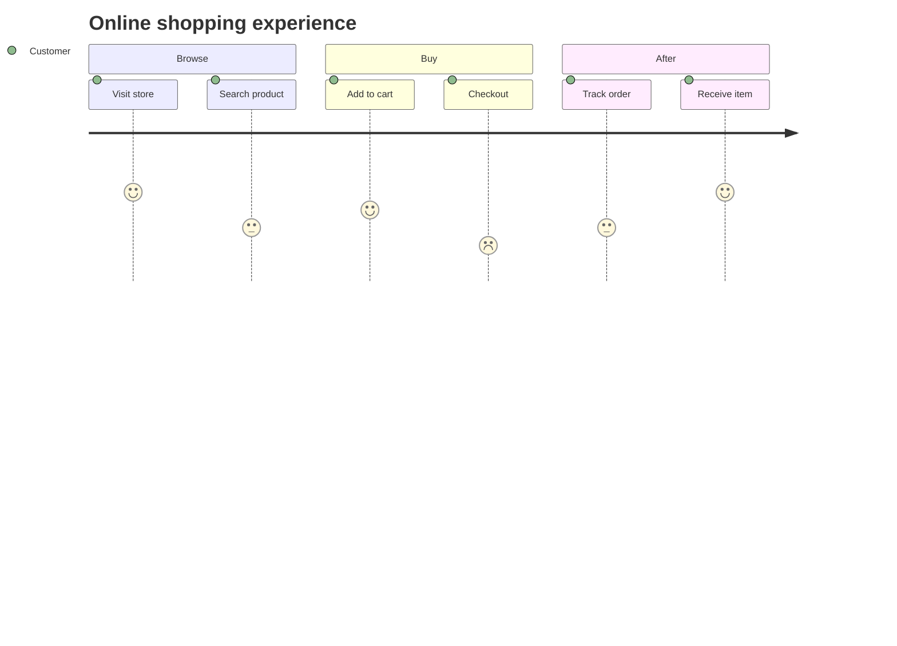

**Git graph** — branches, commits, and merges.
([docs](https://mermaid.js.org/syntax/gitgraph.html))

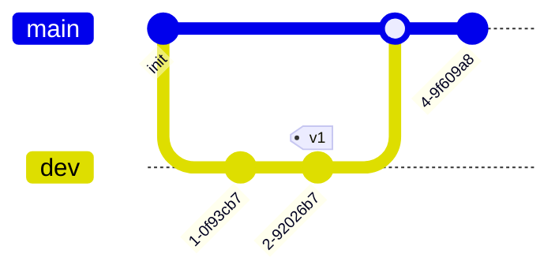

### Software & systems

**C4 context** — software architecture in the C4 model.
([docs](https://mermaid.js.org/syntax/c4.html))

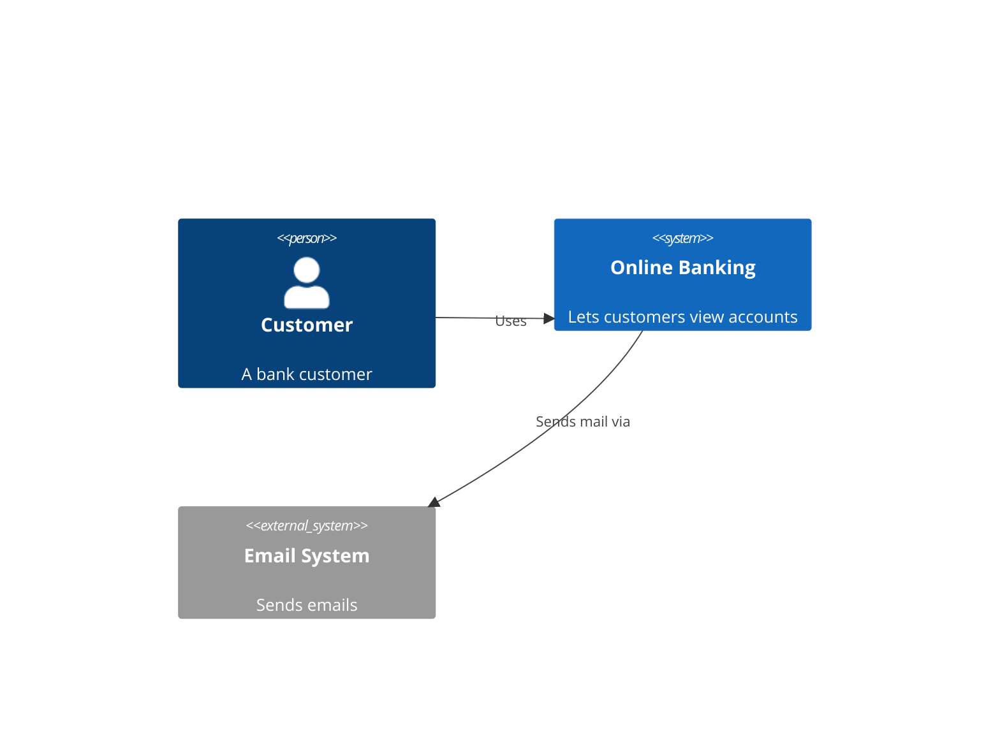

**Architecture diagram** — services and groups with typed icons.
([docs](https://mermaid.js.org/syntax/architecture.html))

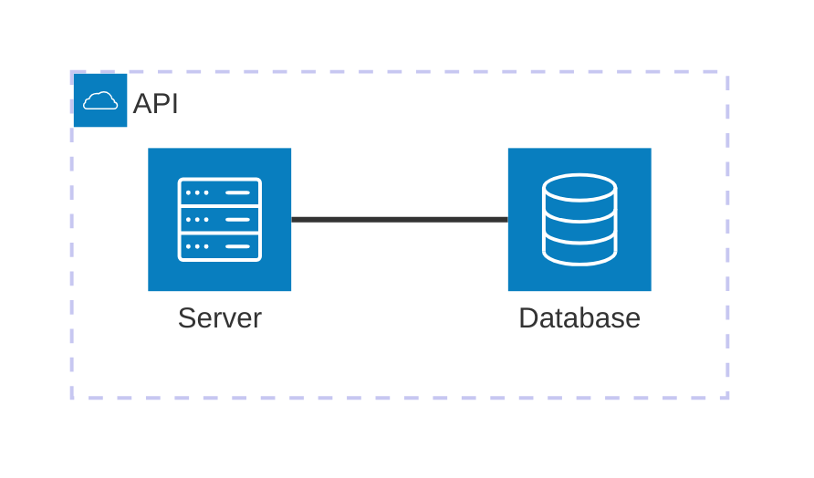

**Block diagram** — a grid of labeled blocks wired together.
([docs](https://mermaid.js.org/syntax/block.html))

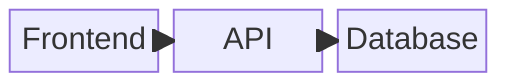

**Packet diagram** — byte/bit layout of a binary format or protocol header.
([docs](https://mermaid.js.org/syntax/packet.html))

```mermaid
packet-beta
title TCP header
0-15: "Source Port"
16-31: "Destination Port"
32-63: "Sequence Number"
64-95: "Acknowledgment Number"
```

**Requirement diagram** — requirements, elements, and how they relate.
([docs](https://mermaid.js.org/syntax/requirementDiagram.html))

```mermaid
requirementDiagram
    requirement test_req {
      id: 1
      text: the system shall work
      risk: high
      verifymethod: test
    }
    element test_entity {
      type: simulation
    }
    test_entity - satisfies -> test_req
```

### Thinking & knowledge

**Mindmap** — a central idea branching outward.
([docs](https://mermaid.js.org/syntax/mindmap.html))

```mermaid
mindmap
  root((mermaid))
    Origins
      Long history
    Uses
      Docs
      Diagrams
    Tools
      Editor
```

**Tree view** — a simple file/hierarchy tree.

```mermaid
treeView-beta
    src
      main.rs
      lib.rs
    tests
      smoke.rs
```

**Venn diagram** — overlapping sets and their members.

```mermaid
venn
    title Hobbies
    set "Music": Alice, Bob, Carol
    set "Sports": Bob, Carol, Dave
    set "Art": Carol, Eve
```

**Ishikawa (fishbone)** — causes contributing to an effect.

```mermaid
ishikawa
    Defects
        Machine
            Wear
        Method
            Unclear steps
        Material
            Bad supplier
```

**Cynefin** — sort items into the Cynefin decision domains.

```mermaid
cynefin-beta
    title Cynefin
    complex
        "New product"
    complicated
        "Scaling up"
    clear
        "Run payroll"
    chaotic
        "Site outage"
```

**Wardley map** — components positioned by value-chain and evolution.

```mermaid
wardley-beta
    title Tea Shop
    component Customer [0.9, 0.5]
    component Cup of Tea [0.7, 0.6]
    component Kettle [0.3, 0.8]
    Customer -> Cup of Tea
    Cup of Tea -> Kettle
```

**Event modeling** — UI / command / event / read-model timeline.

```mermaid
eventmodeling
    tf 1 ui Order.Form
    tf 2 cmd Order.Place
    tf 3 evt Order.Placed
    tf 4 rmo Order.List
```

**Railroad (EBNF)** — syntax diagrams from an EBNF grammar.

```mermaid
railroad-ebnf
    expr = term { "+" term } ;
    term = "a" | "b" | ( expr ) ;
```

### Styling & themes

Any Mermaid diagram can be recolored — pick a built-in theme, override individual
colors, switch to a hand-drawn look, or style individual elements.

**Themes** — put a `config` block in a `---` front-matter header (or a
`%%{init}%%` directive) and set `theme:`. Built-in themes are `default`, `dark`,
`forest`, `neutral`, and `base` (a plain theme meant for customizing).

```mermaid
---
config:
  theme: forest
---
flowchart LR
    A[Ingest] --> B[Transform] --> C[Store]
```

**Custom colors** — `themeVariables` overrides individual theme colors. The
common ones are `primaryColor` (node fill), `primaryBorderColor`,
`primaryTextColor`, `lineColor` (edges/arrows), `background`,
`edgeLabelBackground`, and `clusterBkg` / `clusterBorder` (the `subgraph` box).
Pair them with `theme: base` for full control.
([docs](https://mermaid.js.org/config/theming.html))

```mermaid
---
config:
  theme: base
  themeVariables:
    primaryColor: "#ffe0b2"
    primaryBorderColor: "#e65100"
    lineColor: "#1565c0"
    primaryTextColor: "#3e2723"
---
flowchart LR
    A[Ingest] --> B[Transform] --> C[Store]
```

**Hand-drawn look** — set `look: handDrawn` for sketchy, whiteboard-style shapes.

```mermaid
---
config:
  look: handDrawn
---
flowchart TD
    A[Start] --> B{Decision}
    B --> C[Process]
    B --> D[End]
```

**Per-element styling** — `classDef` names a style and `class` (or the `:::name`
shorthand) applies it to nodes; `style` targets one node directly. Supported
properties are `fill`, `stroke`, `stroke-width`, `stroke-dasharray`, `color`
(text), `opacity`, `font-weight`, `font-style`, `text-decoration`, and
`font-size`. This works in flowchart, ER, class, state, kanban, and block
diagrams.

```mermaid
flowchart TD
    A[Important] --> B[Faded] --> C[Plain]
    classDef strong fill:#c8e6c9,stroke:#2e7d32,font-weight:bold,font-size:18px;
    classDef faded opacity:0.45,font-style:italic;
    class A strong
    class B faded
```

---

## WaveDrom

[WaveDrom](https://wavedrom.com/) draws digital **timing diagrams** and
**register/bitfield** layouts from a compact JSON description (WaveJSON). Use a
` ```wavedrom ` fence. The full syntax is in the
[WaveDrom tutorial](https://wavedrom.com/tutorial.html).

### Timing waveforms

Each signal has a `name` and a `wave` string, where each character is one time
step:

- `p` `P` `n` `N` — clocks (`P`/`N` draw an arrow on the active edge).
- `0` `1` and `l` `h` `L` `H` — low / high levels (`L`/`H` add an edge arrow).
- `x` don't-care (hatched), `z` high-impedance, `d` `u` weak pull-down / pull-up.
- `=` and digits `2`–`9` — labeled data buses in different colors (labels come
  from the `data` array).
- `.` extends the previous value; `|` draws a gap / break.

A signal may also carry `period` (stretch each step) and `phase` (shift it). The
bus colors match WaveDrom's default skin.

```wavedrom
{ "signal": [
    { "name": "clk",  "wave": "P......" },
    { "name": "req",  "wave": "0.1..0." },
    { "name": "bus",  "wave": "x.34.5x", "data": ["addr", "data", "ok"] },
    { "name": "ack",  "wave": "0...1.0" }
]}
```

Signals can be grouped, annotated with a heading/footer, and connected with
`node`/`edge` markers to show timing relationships like setup and hold:

```wavedrom
{ "signal": [
    { "name": "A", "wave": "01........0", "node": ".a........b" },
    { "name": "B", "wave": "0...1...0..", "node": "....c...d.." }
  ],
  "edge": ["a~c setup", "c~d hold", "a<->b period"]
}
```

### Register / bitfield

Give a `reg` array of fields with bit widths and names to draw a register layout
— handy for documenting instruction encodings or protocol words:

```wavedrom
{ "reg": [
    { "bits": 7, "name": "opcode" },
    { "bits": 5, "name": "rd", "attr": "dst" },
    { "bits": 3, "name": "funct3" },
    { "bits": 5, "name": "rs1" },
    { "bits": 5, "name": "rs2" },
    { "bits": 7, "name": "funct7" }
]}
```

Fields tile from bit 0; any bits you don't cover (up to `config.bits` or
`config.lanes`) are drawn as unused cells.

### Logic circuits

An `assign` array draws a gate-level schematic from nested boolean expressions.
Each entry is `[output, expr]`, where `expr` is either a wire name or
`[op, …inputs]`. Operators: `&` (AND), `|` (OR), `^` (XOR), `~` (NOT), and the
inverted-output forms `~&` (NAND), `~|` (NOR), `~^` (XNOR).

```wavedrom
{ "assign": [
  ["out",
    ["|",
      ["&", "a", "b"],
      ["&", ["~", "a"], "c"]
    ]
  ]
]}
```

---

## Tables

Standard Markdown pipe tables render as a clean grid — but a cell is not limited to
plain text. It can hold **inline formatting**, and even a whole **rendered block** —
a formula, a diagram, or an image.

### Inline formatting in cells

Bold, italic, `code`, strikethrough, and links all work inside a cell:

| Style | Example |
|---|---|
| Emphasis | **bold** and *italic* |
| Strikethrough | ~~no longer true~~ |
| Code | `let x = 1;` |
| Link | see the [manual index](README.md) |

### Block content in cells

A cell whose entire content is a single math expression, a **one-line** diagram
fence, or an image renders that block right in the grid. Diagrams use the same
languages as above, written on one line (a table cell is a single line) — and a
literal `|` inside a diagram must be escaped as `\|`, since it would otherwise end
the cell.

| Kind | In a cell | Notes |
|---|---|---|
| Math | $$a^2 + b^2 = c^2$$ | inline `$…$` or display `$$…$$` |
| Mermaid | ```mermaid graph LR; A-->B-->C``` | a small flowchart |
| WaveDrom | ```wavedrom {"signal":[{"name":"clk","wave":"p..."}]}``` | a timing waveform |
| Image |  | a vault image, scaled to the column |

Columns reserve room for the rendered block and the row grows to fit it; a large
diagram scales down to its column rather than blowing out the grid.

### Sizing & overflow

Columns auto-size to their content and the table stretches to the full page width
before any cell wraps. For a table too wide to fit — many columns, or a wide
diagram — **right-click the table → Scrollable**: it lays out at natural width and
scrolls horizontally *inside the table*, so the page itself never scrolls sideways.
Right-click → Fit returns to wrapping.

### Editing a cell in place

By default, moving the cursor into a table reveals its raw `| … |` source, like any
other widget. But you can also edit one cell without disturbing the rest:

- **Double-click a math/diagram/image cell** — or **right-click → Edit diagram /
  Edit cell** — to open a small editor on just that cell. The rest of the table
  stays rendered: the whole table is framed and the active cell is outlined.
- A **live preview** shows the formula or diagram updating as you type.
- **Tab** / **Shift-Tab** move to the next / previous cell; **Esc** or a click
  outside commits the change and re-renders the cell.

Plain text cells still reveal-to-source on a click; the in-place editor is the
default for block cells, and is available on any cell from the right-click menu.

---

## Tips

- **Editing is just text.** Click into any rendered block and the source comes
  back; the floating preview updates as you type, and `Esc` hides it.
- **It's all offline.** Every diagram is rendered locally by Hiker. Nothing is
  fetched, and your notes never leave your machine to be drawn.
- **If it doesn't render,** the source has a syntax error — Hiker keeps showing
  the raw text rather than a broken picture. Check it against the linked docs.
